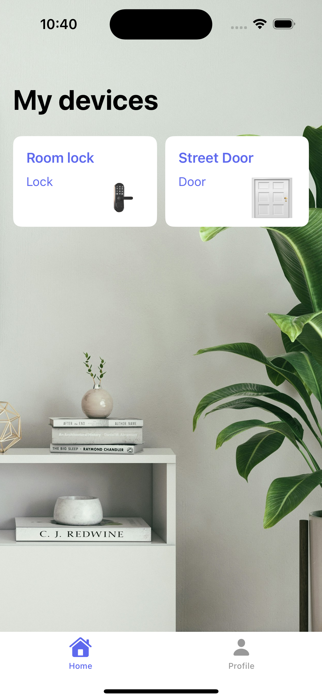

# 🚪 SmartDoor – MQTT iOS Door Controller (Simulation)

**SmartDoor** is an iOS app built with **SwiftUI** that simulates a smart door controller. It was designed to connect with a **Raspberry Pi** using the **MQTT** protocol to unlock a door using **Face ID**. The app serves as a prototype for a home automation system.

> ⚠️ This app **does not include the Raspberry Pi backend code**, so it only demonstrates the user interface and flow. You’ll need to implement the Raspberry Pi logic separately for full functionality.

---

## 🔑 Features

- 🧠 Face ID authentication to "unlock" the door  
- 📡 MQTT protocol setup for device communication  
- 🧪 Simulation-only: UI and flow are functional, but MQTT messages require a compatible Raspberry Pi server  
- 🧩 Clean SwiftUI interface with intuitive UX  

---

## 🛠️ Technologies

- **Swift**
- **SwiftUI**
- **Face ID** (Local Authentication)
- **MQTT** using [CocoaMQTT](https://github.com/emqx/CocoaMQTT)
- **Raspberry Pi** (external, not included in this repo)

---

## 🧪 How It Works

1. User opens the app and authenticates using **Face ID**.
2. On success, the app would publish an MQTT message (e.g., `"open/door"`) to a broker (like Mosquitto).
3. A Raspberry Pi subscribed to that topic would receive the message and trigger the door mechanism.

> Note: Since this app is only a **frontend simulation**, no actual connection is made unless you provide your own MQTT broker and backend.

---

## 📱 UI Preview

<p align="center">
  
</p>


---

## 🚀 Getting Started

1. Clone the repository:
   ```bash
   git clone https://github.com/yisslu/smartDoor.git
2. Open the project in XCode:
   ```bash
   open smartDoor.xcworkspace
3. Build and run on a real device (Face ID doesn't work on simulator).

> 🧪 If you want to test with a real MQTT broker and Raspberry Pi, you'll need to configure the MQTT connection (host, topic, etc.) in the app and implement the corresponding logic on the Raspberry Pi.
